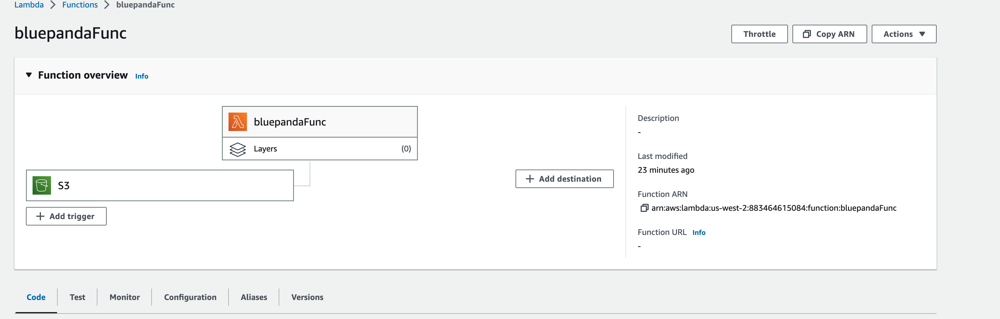

# image-lambda

Author: Ashwini Uppal

This is a simple lambda function that returns a list of images from a JSON file. 

## Usage

The lambda function is triggered by a CloudWatch event that runs when .jpg image is uploaded to the S3 bucket. 

## Deployment

In the function, the image is uploaded to the S3 bucket and the image metadata is added to the JSON file. 

The lambda function is deployed to AWS and can be accessed at the following URL:

https://bluepanda.s3.us-west-2.amazonaws.com/images.json

